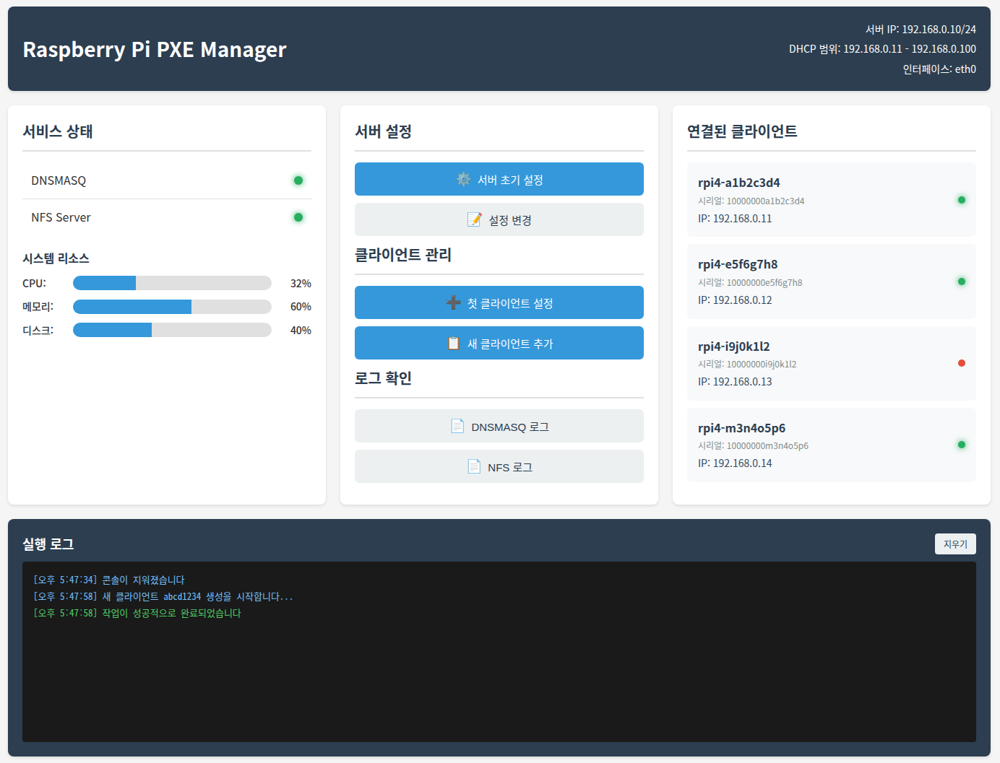

# 🚀 RPI PXE Manager

**Raspberry Pi PXE Boot Manager** - SD 카드 없이도 네트워크를 통해 여러 대의 라즈베리파이를 부팅하고 관리할 수 있는 Python 기반 웹 관리 도구입니다.


*웹 브라우저에서 모든 라즈베리파이를 한눈에 관리할 수 있습니다*

## 📖 이게 뭔가요?

**PXE (Preboot eXecution Environment)**는 네트워크를 통해 컴퓨터를 부팅하는 기술입니다. 이 프로그램을 사용하면:

- 🎯 **SD 카드 없이** 라즈베리파이 부팅 가능
- 🖥️ **웹 브라우저**에서 모든 설정 관리
- 📡 **한 번의 설정**으로 여러 대 라즈베리파이 관리
- 🔄 **실시간 모니터링**으로 상태 확인

## 🎬 빠른 시작 (5분 만에 시작하기)

### 1단계: 필요한 것들 준비하기
- **서버 컴퓨터**: Ubuntu 22.04가 설치된 PC/노트북 (고정 IP: 192.168.0.10)
- **라즈베리파이 4**: 1대 이상
- **SD 카드**: 라즈베리파이 OS가 설치된 것 (첫 설정용)
- **유선 랜 케이블**: 모든 장치를 같은 네트워크에 연결

### 2단계: 프로그램 다운로드 및 설치
```bash
# 프로그램 다운로드
git clone https://github.com/minoTrey/rpi-pxe-manager.git
cd rpi-pxe-manager

# 자동 설치 (모든 의존성 자동 설치)
./setup.sh
```

### 3단계: 서버 시작
```bash
sudo python3 rpi_pxe_server.py
```

### 4단계: 웹 관리 페이지 접속
웹 브라우저에서 `http://192.168.0.10:5000` 접속

### 5단계: 한 번의 클릭으로 완료!
1. **"서버 초기 설정"** 버튼 클릭
2. **"첫 클라이언트 설정"** 버튼 클릭해서 SD 카드 내용 복사
3. 라즈베리파이에서 SD 카드 제거 → 전원 재시작
4. 🎉 **완료!** 네트워크 부팅 성공!

## 🌟 주요 기능

### 🖥️ 웹 관리 인터페이스
- **직관적인 대시보드**: 모든 라즈베리파이 상태를 한눈에 확인
- **실시간 모니터링**: CPU, 메모리, 디스크 사용량 실시간 표시
- **서비스 상태 확인**: DHCP, NFS 서버 상태 모니터링
- **로그 뷰어**: 시스템 로그를 웹에서 바로 확인

### ⚡ 원클릭 설정
- **서버 초기화**: 복잡한 네트워크 설정을 한 번의 클릭으로
- **클라이언트 추가**: SD 카드를 꽂고 버튼 하나로 설정 완료
- **자동 복제**: 기존 라즈베리파이 설정을 새 장치에 복사

### 🔧 라즈베리파이 관리 도구
- **EEPROM 업데이트**: 네트워크 부팅을 위한 펌웨어 자동 설정
- **SSH 활성화**: 원격 접속을 위한 자동 설정
- **상태 모니터링**: 각 라즈베리파이의 온라인/오프라인 상태 실시간 확인

## 💻 상세 사용법

### 📋 시스템 요구사항

| 항목 | 서버 | 라즈베리파이 |
|------|------|-------------|
| **OS** | Ubuntu 22.04 이상 | Raspberry Pi OS |
| **Python** | 3.8+ (기본 설치된 버전 사용) | 3.8+ (기본 설치된 버전 사용) |
| **네트워크** | 고정 IP (192.168.0.10) | DHCP 또는 고정 IP |
| **연결** | 유선 이더넷 필수 | 유선 이더넷 필수 |

### 🔧 자세한 설치 과정

#### 1️⃣ 서버 컴퓨터 설정

**네트워크 설정** (중요!)
```bash
# 네트워크 인터페이스 확인
ip addr

# 고정 IP 설정 (예: eth0 인터페이스)
sudo nano /etc/netplan/01-netcfg.yaml
```

netplan 설정 예시:
```yaml
network:
  version: 2
  ethernets:
    eth0:  # 실제 인터페이스 이름으로 변경
      addresses:
        - 192.168.0.10/24
      gateway4: 192.168.0.1
      nameservers:
        addresses: [8.8.8.8, 8.8.4.4]
```

```bash
# 네트워크 설정 적용
sudo netplan apply

# 프로그램 설치
git clone https://github.com/minoTrey/rpi-pxe-manager.git
cd rpi-pxe-manager
./setup.sh
```

#### 2️⃣ 웹 관리 인터페이스 사용법

**서버 시작**
```bash
# 가상환경을 사용한 경우
sudo env PATH=$PATH python3 rpi_pxe_server.py

# 시스템 전역 설치한 경우
sudo python3 rpi_pxe_server.py
```

> 💡 **sudo가 필요한 이유**: 
> - 시스템 서비스(DHCP, NFS) 상태 확인
> - 설정 스크립트 실행 (네트워크 설정 변경)
> - 시스템 로그 읽기
> 
> ⚠️ **가상환경 사용시 주의**: `sudo`는 시스템 Python을 사용하므로 `sudo env PATH=$PATH python3`로 실행

**웹 브라우저 접속**
- URL: `http://192.168.0.10:5000`
- 모든 설정을 웹에서 진행할 수 있습니다

**주요 버튼 설명**
- 🔧 **"서버 초기 설정"**: DHCP, NFS, TFTP 서버 자동 구성
- ➕ **"첫 클라이언트 설정"**: SD 카드에서 파일시스템 복사
- 📋 **"새 클라이언트 추가"**: 기존 설정을 새 라즈베리파이에 복제

#### 3️⃣ 라즈베리파이 준비하기

**1단계: SD카드에 라즈베리파이 OS 설치**
1. [Raspberry Pi Imager](https://www.raspberrypi.org/software/) 다운로드 및 설치
2. SD카드 (16GB 이상) 준비
3. Raspberry Pi Imager로 **Raspberry Pi OS Legacy (64-bit)** 또는 **Bullseye 기반 버전** 설치
   - ⚠️ **중요**: Bookworm(최신) 버전은 EEPROM 경로가 다르므로 Legacy/Bullseye 사용 권장
4. 설정 옵션에서:
   - **SSH 활성화** ✅
   - **사용자명/비밀번호** 설정 (예: pi/raspberry)
   - **WiFi 설정** (필요시)
5. SD카드를 라즈베리파이에 삽입 후 부팅

**2단계: EEPROM 업데이트** (네트워크 부팅 활성화)
```bash
# 라즈베리파이에서 실행
# 1. 현재 EEPROM 설정을 파일로 추출
sudo rpi-eeprom-config > bootconf.txt

# 2. 네트워크 부팅 설정 추가
echo "BOOT_ORDER=0xf21" >> bootconf.txt
echo "NET_INSTALL_ENABLED=1" >> bootconf.txt
echo "DHCP_TIMEOUT=45000" >> bootconf.txt
echo "DHCP_REQ_TIMEOUT=4000" >> bootconf.txt

# 3. 최신 EEPROM 파일 찾기 (경로 확인 후)
if [ -d "/lib/firmware/raspberrypi/bootloader/stable" ]; then
    EEPROM_DIR="/lib/firmware/raspberrypi/bootloader/stable"
elif [ -d "/usr/lib/raspberrypi-bootloader" ]; then
    EEPROM_DIR="/usr/lib/raspberrypi-bootloader"
else
    echo "EEPROM 디렉터리를 찾을 수 없습니다. rpi-eeprom 패키지 설치 확인"
    sudo apt update && sudo apt install rpi-eeprom -y
    EEPROM_DIR="/lib/firmware/raspberrypi/bootloader/stable"
fi
LATEST_EEPROM=$(ls -1 $EEPROM_DIR/pieeprom-*.bin | sort -V | tail -1)

# 4. 새 EEPROM 이미지 생성
sudo rpi-eeprom-config --out netboot-pieeprom.bin --config bootconf.txt $LATEST_EEPROM

# 5. EEPROM 업데이트 적용
sudo rpi-eeprom-update -d -f ./netboot-pieeprom.bin

# 6. SSH 서비스 활성화
sudo systemctl enable ssh
sudo systemctl start ssh

# 7. 재부팅
sudo reboot

# 8. 재부팅 후 설정 확인
vcgencmd bootloader_config | grep BOOT_ORDER
# BOOT_ORDER=0xf21 이 나와야 함
```

## 📱 단계별 사용 가이드

### 🎯 시나리오 1: 처음 설정하는 경우

**목표**: 한 대의 라즈베리파이를 네트워크 부팅으로 설정

1. **서버 컴퓨터에서** 프로그램 실행
   ```bash
   cd rpi-pxe-manager
   sudo python3 rpi_pxe_server.py
   ```

2. **웹 브라우저**에서 `http://192.168.0.10:5000` 접속

3. **"서버 초기 설정"** 버튼 클릭
   - DHCP, NFS, TFTP 서버가 자동으로 설정됩니다
   - 완료까지 약 2-3분 소요

4. **설정된 SD카드를 서버 컴퓨터**에 연결 (USB 카드리더 사용)

5. **"첫 클라이언트 설정"** 버튼 클릭
   - 라즈베리파이 시리얼 번호 입력
   - SD 카드 선택 후 설정 시작
   - 파일시스템 복사 완료까지 약 5-10분 소요

6. **라즈베리파이**에서 SD 카드 제거 후 재부팅
   - 자동으로 네트워크 부팅됩니다!

### 🔄 시나리오 2: 추가 라즈베리파이 연결하는 경우

**목표**: 기존 설정을 새 라즈베리파이에 복사

1. **새 라즈베리파이**에 SD카드로 라즈베리파이 OS 설치 (위의 "1단계" 참조)

2. **EEPROM 업데이트** (한 번만)
   ```bash
   # 라즈베리파이에서 실행 (위의 "2단계" 참조)
   sudo rpi-eeprom-config > bootconf.txt
   echo "BOOT_ORDER=0xf21" >> bootconf.txt
   echo "NET_INSTALL_ENABLED=1" >> bootconf.txt
   
   # EEPROM 파일 경로 확인
   if [ -d "/lib/firmware/raspberrypi/bootloader/stable" ]; then
       EEPROM_DIR="/lib/firmware/raspberrypi/bootloader/stable"
   elif [ -d "/usr/lib/raspberrypi-bootloader" ]; then
       EEPROM_DIR="/usr/lib/raspberrypi-bootloader"
   else
       sudo apt install rpi-eeprom -y
       EEPROM_DIR="/lib/firmware/raspberrypi/bootloader/stable"
   fi
   LATEST_EEPROM=$(ls -1 $EEPROM_DIR/pieeprom-*.bin | sort -V | tail -1)
   sudo rpi-eeprom-config --out netboot-pieeprom.bin --config bootconf.txt $LATEST_EEPROM
   sudo rpi-eeprom-update -d -f ./netboot-pieeprom.bin
   sudo systemctl enable ssh && sudo systemctl start ssh
   sudo reboot
   ```

3. **웹 관리 페이지**에서 "새 클라이언트 추가" 클릭

4. **설정 정보 입력**
   - 복사할 기존 클라이언트 선택
   - 새 라즈베리파이 시리얼 번호 입력
   - (선택) MAC 주소 입력

5. **완료!** 새 라즈베리파이가 자동으로 네트워크 부팅됩니다

## 🔧 고급 설정

### 🌐 네트워크 설정 변경
웹 관리 페이지에서 "설정 변경" 버튼을 클릭하여 다음을 수정할 수 있습니다:
- 서버 IP 주소
- DHCP 범위
- 네트워크 인터페이스

### 📊 모니터링 기능
- **실시간 상태**: 각 라즈베리파이의 온라인/오프라인 상태
- **시스템 리소스**: 서버의 CPU, 메모리, 디스크 사용량
- **서비스 로그**: DHCP, NFS 서버 로그 실시간 확인

## ❓ 문제 해결

### 🚨 자주 발생하는 문제들

**Q: 서버가 시작되지 않아요!**
```bash
# 다음 순서로 확인해보세요
sudo netstat -tulpn | grep :5000  # 포트 충돌 확인
python3 --version                 # Python 버전 확인 (3.8+ 필요, 기본 설치 버전도 OK)
pip3 install -r requirements.txt  # 의존성 재설치
sudo python3 rpi_pxe_server.py    # sudo 권한으로 실행
```

**Q: 라즈베리파이가 네트워크 부팅하지 않아요!**
```bash
# 라즈베리파이에서 확인
vcgencmd bootloader_config         # EEPROM 설정 확인
sudo rpi-eeprom-update -d -a      # EEPROM 업데이트
```

**Q: 웹 페이지가 접속되지 않아요!**
- 방화벽 확인: `sudo ufw status`
- 네트워크 연결 확인: `ping 192.168.0.10`
- 서버 로그 확인: 콘솔에서 오류 메시지 확인

### 📋 로그 확인 방법
```bash
# 시스템 서비스 로그
sudo journalctl -u dnsmasq -f      # DHCP 로그
sudo journalctl -u nfs-kernel-server -f  # NFS 로그

# 네트워크 상태 확인
sudo systemctl status dnsmasq
sudo systemctl status nfs-kernel-server
```

## 📁 프로젝트 구조
```
rpi-pxe-manager/
├── 🖥️ rpi_pxe_server.py      # Flask 웹 서버 (메인)
├── 🎬 demo_server.py         # 데모용 서버 (스크린샷용)
├── 📁 templates/             # 웹 페이지 템플릿
├── 📁 static/               # CSS, JavaScript 파일
├── 📁 client/               # 라즈베리파이용 설정 도구
├── 📁 docs/images/          # 문서용 이미지 파일
├── ⚙️ setup.sh              # 자동 설치 스크립트
├── 📋 requirements.txt      # Python 패키지 목록
└── 📖 README.md            # 이 문서
```

## 🤝 기여하기
- 🐛 **버그 신고**: [Issues](https://github.com/minoTrey/rpi-pxe-manager/issues)
- 💡 **기능 제안**: [Issues](https://github.com/minoTrey/rpi-pxe-manager/issues)
- 🔧 **코드 기여**: Pull Request 환영!

## 📜 라이센스
MIT License - 자유롭게 사용하고 수정할 수 있습니다.

## 🙏 크레딧
이 프로젝트는 복잡한 PXE 부팅 설정을 쉽게 만들기 위해 제작되었습니다. 
기존 PXE 설정 스크립트들을 참고하여 웹 기반 관리 인터페이스를 구현했습니다.