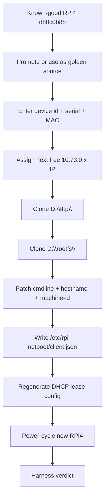

# Clone Workflow

Goal: turn the first successful RPi4 into a repeatable click-style clone flow for additional Raspberry Pi 4 devices.

## Command Surface

Primary script:

```text
windows/tools/clone-rpi4-client.ps1
```

Commands:

```text
plan
register
clone
verify
promote-golden
```

## Flow

Current implementation requires the operator to enter the new RPi4 serial and MAC.

Before cloning a new board:

1. Make a Pi 4 Network Boot EEPROM SD with `RPi4 EEPROM SD`.
2. Boot the new RPi4 once from that SD to update EEPROM.
3. Power off and remove the SD.
4. Read the serial and MAC from a normal Pi OS boot when needed:

   ```bash
   cat /proc/cpuinfo | grep Serial
   cat /sys/class/net/eth0/address
   ```

   Enter the last 8 hex characters of the serial in the GUI. Example: `10000000d80c0b88` becomes `d80c0b88`.

5. Use `새 RPi4 등록/복제`.
6. Restart `부팅 서비스 시작` so the DHCP reservation file is reloaded.
7. Boot the new RPi4 with no SD card and Ethernet connected.



## Protection Rules

- `d80c0b88` is the protected known-good source.
- Existing target folders are not overwritten unless `-Force` is explicit.
- Resolved target paths must stay under `D:\tftp` and `D:\rootfs`.
- haneWIN may appear in evidence, but not in production provider selection.
- Device id such as `rpi-001` becomes hostname and internal program metadata.

## Next Automation Layer

The PowerShell script is the automation core.
The GUI wraps this as a simple clone dialog today:

1. Device ID, serial, and MAC input.
2. Optional IP input.
3. Golden source fixed to `d80c0b88` for now.
4. Register and clone.

Possible next improvement:

- Parse `D:\logs\rpi-boot-lite.log` for `DHCP ignored unknown MAC ...`.
- Offer unknown MAC candidates in the clone dialog.
- Keep serial as a required confirmation unless a future helper reports it reliably.
