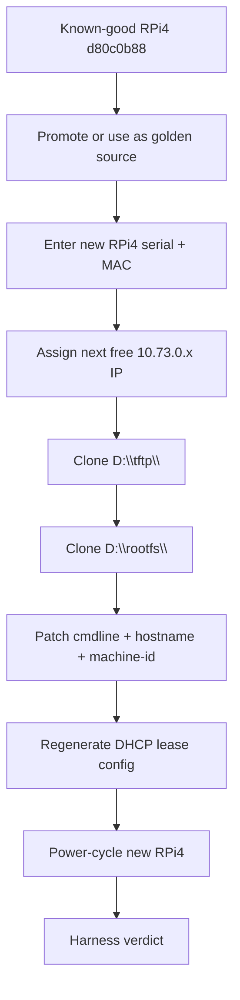

# Clone Workflow

Goal: turn the first successful RPi4 into a repeatable click-style clone flow for additional Raspberry Pi 4 devices.

## Command Surface

Primary script:

```text
windows/tools/clone-rpi4-client.ps1
```

Commands:

```text
plan
register
clone
verify
promote-golden
```

## Flow



## Protection Rules

- `d80c0b88` is the protected known-good source.
- Existing target folders are not overwritten unless `-Force` is explicit.
- Resolved target paths must stay under `D:\tftp` and `D:\rootfs`.
- haneWIN may appear in evidence, but not in production provider selection.

## Next Automation Layer

The PowerShell script is the automation core.
The GUI should wrap this as a wizard:

1. New RPi4 clone.
2. Serial/MAC input or detection.
3. Suggested IP.
4. Golden source selection.
5. Register and clone.
6. Provider reload.
7. Boot test.
